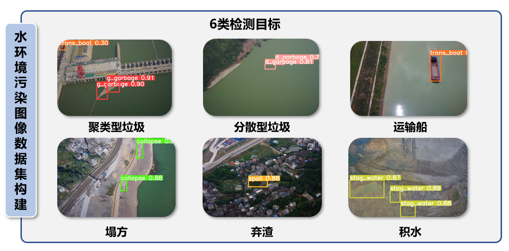

# WPD水资源污染要素检测数据集

## 1. 数据集介绍
本数据集(WPD)主要用于水资源污染要素实时检测，数据来源于低空无人机自动巡检系统采集的高清水域影像。数据集包含了聚集型垃圾、分散型垃圾、废弃渣料、施工区域塌方等污染要素的图像及其标注信息。通过该数据集可训练目标检测模型，实现对水域污染要素的自动监测，为水资源管理和保护提供技术支持。

其中数据集的类别如下：
| 类别编号 | 类别名称 | 类别标识 | 说明 |
|---------|---------|---------|------|
| 1 | 聚集型垃圾 | g_garbage | 大量漂浮在水面的成堆垃圾 |
| 2 | 分散型垃圾 | d_garbage | 零散分布在水面的垃圾 |
| 3 | 运输船 | ship | 水域中的各类运输船只 |
| 4 | 塌方 | collapse | 施工区域或岸边的塌方现象 |
| 5 | 弃渣 | spoil | 施工或生产过程中产生的废弃渣料 |
| 6 | 积水 | water | 非正常蓄水区域的积水现象 |

本数据集区域集中在水库和河网地带，这些区地域形要素复杂，包含水域、岸线、植被等多种自然元素，涵盖水库、河道等不同水体类型。

## 2. 数据集特点
本数据集具有以下主要特点：

(1) 类别丰富
包含6个主要污染要素类别
涵盖聚集型垃圾、分散型垃圾、运输船、塌方、弃渣、积水等
全面覆盖水域环境中常见的污染要素
(2) 场景多样性
数据采集区域包括水库和河网地带
包含多种地形要素：水域、岸线、植被等
涵盖不同水体类型：水库、河道等场景
(3) 数据质量优势
采用低空无人机系统采集，图像清晰度高
专业团队进行标注，确保标注质量
真实场景数据，直接反映实际污染情况
(4) 应用价值
填补水域污染要素检测数据集的空缺
可用于开发自动化水质监测系统
为水资源管理和污染防治提供数据支持
本数据集在水污染要素检测领域具有重要价值，可为相关算法研究和实际应用提供可靠的训练验证数据。

## 3. 数据集下载

通过网盘分享的文件：WPD.zip
链接: https://pan.baidu.com/s/1q_w9301kuh1YZJnHkPJ9pw 提取码: jvvy

## 4. 数据集使用须知

### 4.1 引用说明
如果您在研究中使用了本数据集，请点击本项目右侧的`Cite this repository`进行引用。

### 4.2 使用协议
本数据集基于知识共享署名-非商业性使用-相同方式共享 4.0 国际 (CC BY-NC-SA 4.0) 协议授权使用。

您可以自由地：
- 共享 — 在任何媒介以任何形式复制、发行本作品
- 演绎 — 修改、转换或以本作品为基础进行创作

惟须遵守下列条件：
- **署名** — 您必须给出适当的署名，提供指向本许可协议的链接，同时标明是否作了修改。
- **非商业性使用** — 您不得将本作品用于商业目的。
- **相同方式共享** — 如果您再混合、转换或者基于本作品进行创作，您必须基于与原先许可协议相同的许可协议分发您贡献的作品。

### 4.3 联系方式
如果对数据集有任何问题，欢迎联系：zhou_wei@xtu.edu.cn
